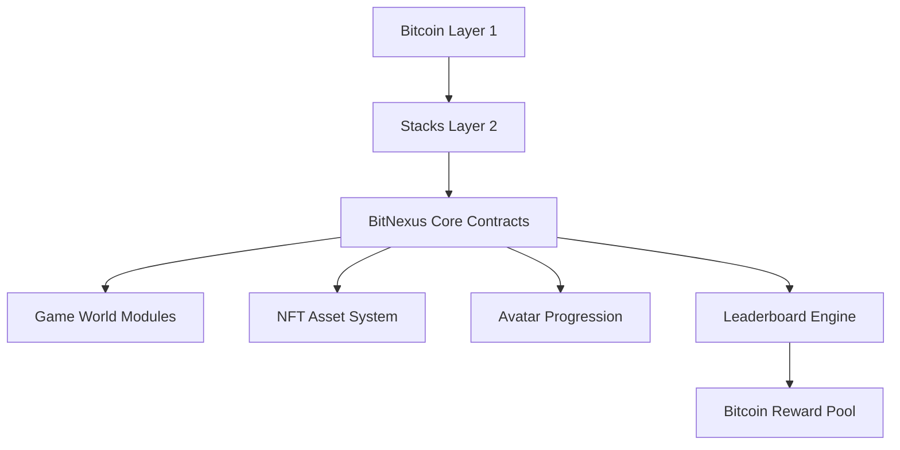

# BitNexus Gaming Protocol

## A Bitcoin Layer 2 Gaming Ecosystem Powered by Stacks

## 🚀 Overview

**BitNexus** is a decentralized gaming protocol built on the **Stacks** smart contract platform, leveraging the security of Bitcoin. It enables a fully on-chain metaverse where players can own, upgrade, and trade cross-game assets, earn Bitcoin rewards, and evolve persistent avatars—all in a trustless, composable environment.

---

## 🧩 Key Features

| Feature                     | Description                                                                 |
| --------------------------- | --------------------------------------------------------------------------- |
| **True Asset Ownership**    | NFTs represent game items with rarity, power levels, and upgradeable stats. |
| **Cross-World Avatars**     | Persistent, upgradable identities that level up across games.               |
| **Multi-World Support**     | Game worlds with configurable access rules and reward structures.           |
| **Bitcoin-Powered Rewards** | Leaderboards and tournaments reward players in BTC.                         |
| **DAO Governance**          | Protocol upgrades and economic rules governed by token holders.             |
| **Asset Interoperability**  | NFTs usable across multiple games, retaining history and value.             |

---

## 🧱 System Architecture

### High-Level Structure



### Component Workflows

1. **Asset Minting**

   ```
   Player → AssetFactory Contract → NFT Minted with Metadata
   ```

2. **Avatar Progression**

   ```
   Game Client → Experience Contract → XP Calculation → Avatar Level Up
   ```

3. **BTC Reward Distribution**

   ```
   Leaderboard Contract → Score Aggregation → BTC Payout Logic
   ```

---

## 📜 Smart Contract Architecture

### Core Modules

| Contract              | Purpose                    | Key Functions                                       |
| --------------------- | -------------------------- | --------------------------------------------------- |
| **AssetFactory**      | NFT minting and transfers  | `mint-bitnexus-asset`, `transfer-game-asset`        |
| **AvatarSystem**      | Create and upgrade avatars | `create-avatar`, `update-avatar-experience`         |
| **WorldManager**      | Manage game worlds         | `create-game-world`, `update-world-access`          |
| **CompetitionEngine** | Leaderboard & rewards      | `update-player-score`, `distribute-bitcoin-rewards` |

### Data Structures

* `bitnexus-asset`: Stores item metadata (name, rarity, power).
* `avatar-metadata`: Tracks XP, level, equipment, and achievements.
* `game-worlds`: World definitions with access/reward settings.
* `leaderboard`: Player stats and scores.

### Constants & Validation

```clarity
(define-constant MAX-LEVEL u100)
(define-constant BASE-EXPERIENCE-REQUIRED u100)
(define-data-var protocol-fee uint u10)
```

* **Experience logic**: Uses helper functions like `validate-experience-gain` and `can-level-up`.
* **Access control**: Admin-restricted functions gated via `protocol-admin-whitelist`.

---

## 💻 Installation & Deployment

### Prerequisites

* [Stacks CLI](https://docs.stacks.co) v3.0+
* [Clarinet SDK](https://github.com/hirosystems/clarinet)
* Bitcoin testnet wallet (for reward simulation)

### Setup Steps

```bash
# Clone repository
git clone https://github.com/bitnexus/protocol-core.git
cd protocol-core

# Initialize environment
clarinet environment setup

# Deploy smart contracts
clarinet contract deploy AssetFactory
clarinet contract deploy AvatarSystem
clarinet contract deploy WorldManager
clarinet contract deploy CompetitionEngine
```

---

## 🧪 Usage Examples

### Mint a Game Asset

```clarity
(contract-call? .AssetFactory mint-bitnexus-asset
  "Dragon Sword"
  "Legendary weapon of ancient kings"
  "legendary"
  u950
  u1
  (list "fire" "magic" "attack+"))
```

### Create an Avatar

```clarity
(contract-call? .AvatarSystem create-avatar
  "Warrior01"
  (list u1 u3 u5))
```

### Distribute BTC Rewards

```clarity
(contract-call? .CompetitionEngine distribute-bitcoin-rewards)
```

---

## 🌐 Off-Chain Integrations

* **Frontend (React/Next.js)**: Player UI with avatar inventory, leaderboards, and world access.
* **Stacks Wallets**: Supports Hiro and Xverse for player interactions.
* **Optional API Layer**: Index blockchain state for faster UI updates.
* **Bitcoin Settlement Layer**: Off-chain service for BTC payout after on-chain validation.

---

## 🔒 Security Best Practices

* All state transitions logged immutably on-chain.
* Rigorous input validation for names, attributes, and scores.
* Admin-only functions protected via on-chain whitelist.
* BTC rewards transparently calculated on-chain.

---

## 🤝 Contributing

We welcome developers, designers, and world-builders to join the BitNexus ecosystem.

### How to Contribute

1. Fork this repo
2. Create a feature branch:

   ```bash
   git checkout -b feature/your-feature
   ```
